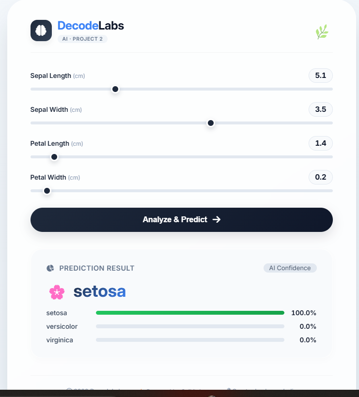

# 🌿 Iris Species Classifier

> **DecodeLabs Internship Project 2** | Batch 2026

A production-ready **Machine Learning** web application that classifies Iris flowers into three species (Setosa, Versicolor, Virginica) using **Supervised Learning**. This project demonstrates a complete AI pipeline: Data Exploration, Feature Engineering, Cross-Validation, Model Selection, and Flask Deployment.

## 🚀 Features

- **Multi-Algorithm Comparison**: Compares KNN, Logistic Regression, Decision Tree, Random Forest, and Gradient Boosting.
- **Hyperparameter Tuning**: Uses 5-Fold Cross-Validation (`GridSearchCV`) to find the best model.
- **Web Interface**: Interactive Flask web app with real-time predictions and confidence bars.
- **REST API**: Exposes a `/api/predict` endpoint for programmatic access.
- **Professional Pipeline**: Scikit-Learn `Pipeline` ensures data scaling is applied consistently.

## 📸 Live Demo

*The web interface showing a prediction for Setosa with confidence bars.*

## 🛠️ Tech Stack

- **Backend**: Python, Flask
- **Machine Learning**: Scikit-Learn (StandardScaler, GridSearchCV, KNN, etc.)
- **Frontend**: HTML5, CSS3 (Jinja2 templating)
- **Data Handling**: Pandas, NumPy

